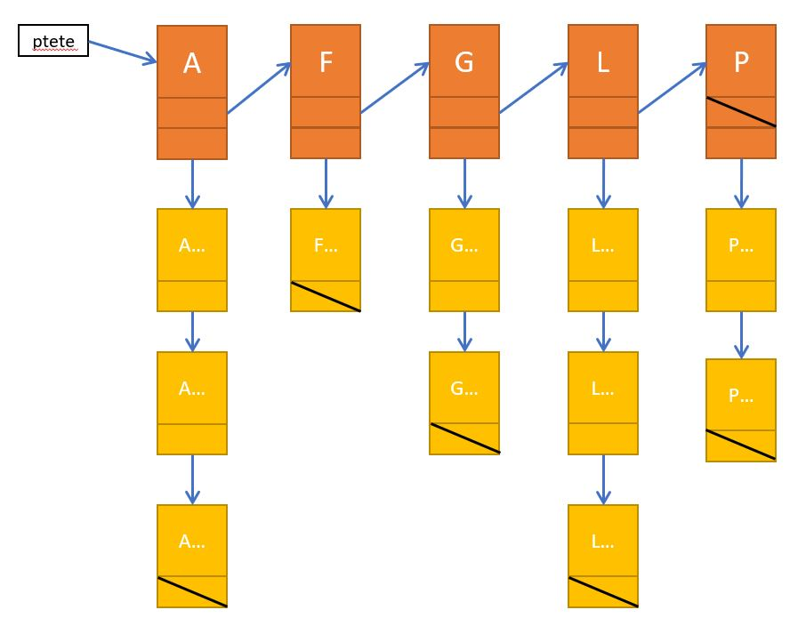

# Exercice 2

Pour cette exercice, il faut réaliser une liste de liste de type dictionnaire (l'exemple donné se base sur des mots du dictionnaire vous pouvez traiter d'autres données).

On doit pouvoir réaliser les opérations suivantes sur la liste : 
- Ajouter un mot (et peut-être une lettre)
- Supprimer un mot (et peut-être une lettre)
- Lister tous les mots
- Lister toutes les lettres
- Lister les mots par lettre
- Rechercher un mot
- Vider complètement la liste

Un menu est a disposition de l'utilisateur pour choisir l'opération désirée.

