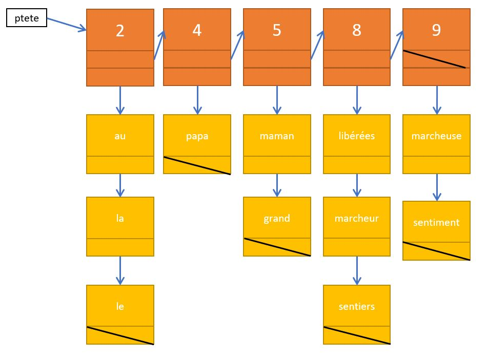

#Exercice 3

Pour cette exercice, nous allons partir d'un fichier type `TXT` contenant un texte quelconque (attention lecture dans un fichier texte).
Votre programme doit ouvrir et lire le fichier. Il doit stocker dans une liste de liste tous les mots du texte en les organisant par taille de mots. Dans la liste, les mots ne doivent pas être triée par ordre alphabétique.

## Exemple

L'état de la liste de liste à un moment donné du comptage.

